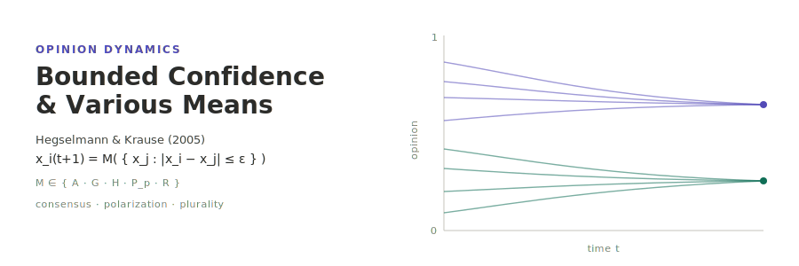

<p align="center"></p>

[English](README.md) | **日本語**

# Opinion Dynamics Driven by Various Ways of Averaging — Hegselmann & Krause (2005)

Hegselmann & Krause (2005)「Opinion Dynamics Driven by Various Ways of Averaging」(*Computational Economics* 25, 381–405) の連続意見力学モデルの再現実装である．各エージェントは意見 `x_i ∈ [0,1]` を持ち，毎ステップ，信頼集合 `I(i) = { j : |x_i − x_j| ≤ ε }` 内の意見を 5 種の平均演算子 — 算術 (A)・幾何 (G)・調和 (H)・べき/Hölder (P_p)・ランダム (R) — のいずれかで集約して更新する．モデルは完全グラフ (everyone-sees-everyone，非空間) 上にあり，信頼集合は意見距離から毎ステップ動的に再計算される．シミュレーションは [socsim](https://github.com/akitenkrad/rs-social-simulation-tools) フレームワーク上の Rust で，可視化ツールは Python で実装している．

## インストールとクイックスタート

```bash
# Rust シミュレーションのビルド
cargo build --release

# 標準設定で実行 (n=625, ε=0.15, 算術平均, seed=42)
cargo run --release -- run --n 625 --eps 0.15 --mean A --seed 42

# Python 可視化ツールのインストール (workspace ルートで)
uv sync

# 最新の実行結果を可視化 (意見軌跡 + メトリクス)
uv run hegselmann-tools visualize
```

## ドキュメント

- [ユースケース](docs/usecases.ja.md) — 本プロジェクトでできること．他ドキュメントへの導線．
- [CLI](docs/cli.ja.md) — Rust CLI の `run` / `sweep` サブコマンドとフラグ．
- [可視化](docs/visualization.ja.md) — Python `hegselmann-tools` と出力の読み方．
- [アーキテクチャ](docs/architecture.ja.md) — リポジトリ構成，socsim フレームワーク，平均演算子，参考文献．

## スコープ

本リポジトリは現在 **Phase 1** (完全グラフ上の A/G/H/P/R 切替の有界信頼モデル，`run` サブコマンド，三相転移の基本再現) と **Phase 2** (ε の `sweep` および Python の `visualize` / `visualize-sweep` ツール) を実装している．ネットワーク版 (`socsim-net`)，論文一括再現 (`reproduce`)，PAM levelling の解析的検証は将来作業 (Phase 3) とし，拡張点を随所に残している．

## ライセンス

MIT

---
*This file was generated by Claude Code.*
